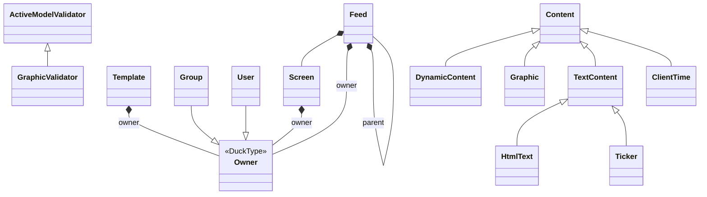

started this to make sense of how the model classes are connected.

as both Group and User can be the owner of various things, theres a 
hidden common supertype ("Duck Type") "Owner", I added it here for clarity.

